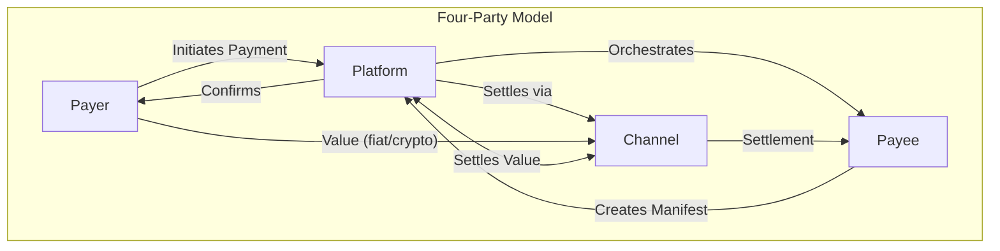
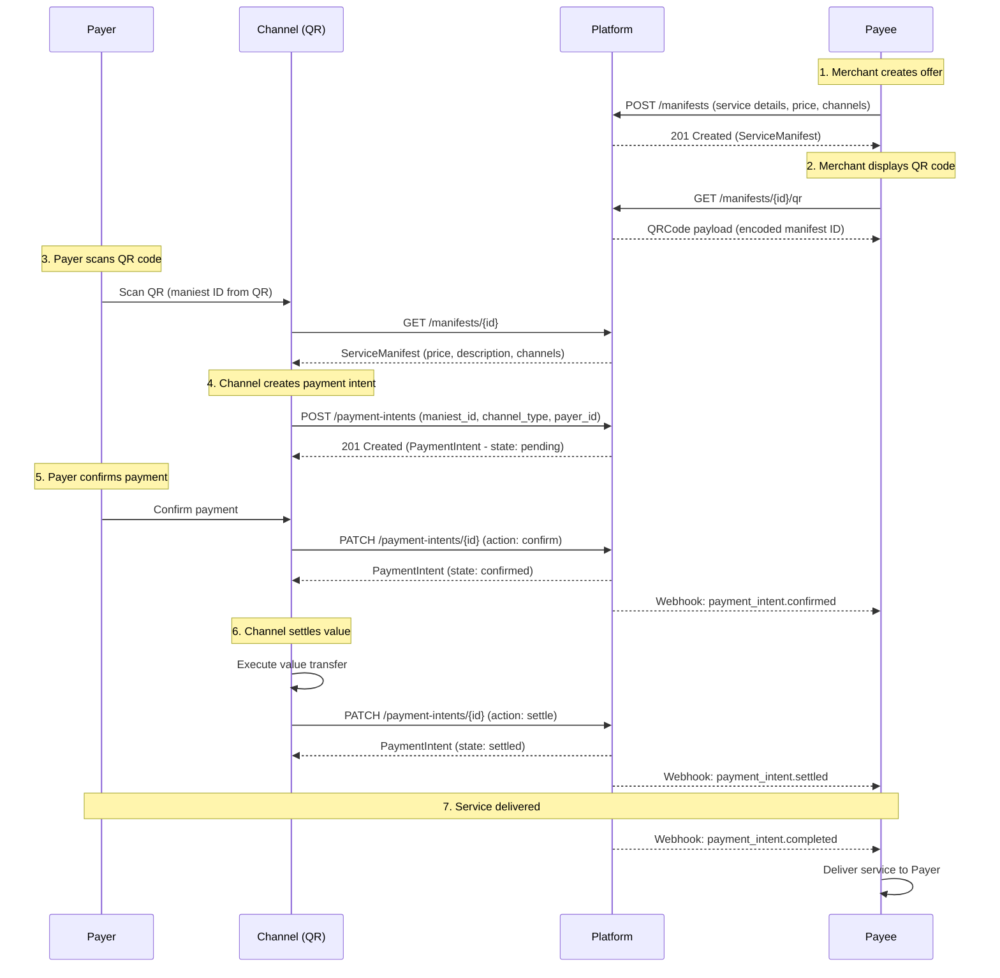

# Architecture

This section defines the architectural foundations of the ItPay Protocol: the four-party model, the two-layer design, data flow semantics, and the channel adapter interface.

## Four-Party Model

The ItPay Protocol defines exactly four roles that MUST be present in every payment interaction. These roles represent separable concerns that MAY be fulfilled by distinct legal entities or MAY be combined in a single implementation (e.g., a Platform that also operates a Channel).



### Role Definitions

#### Payer

The Payer is the entity that transfers value in exchange for a service. The Payer initiates the payment by interacting with a channel adapter.

**Responsibilities:**
- Select a payment channel from those offered in the ServiceManifest
- Provide authorization (signature, PIN, biometric, or channel-specific approval)
- MAY provide payer identity information when required by the channel (e.g., authenticated subscriptions)
- MAY request a refund within the terms defined in the ServiceManifest

**Protocol interactions:**
- The Payer interacts ONLY with the Channel adapter, not directly with the Platform API
- The Payer's identity is represented by a `payer_id` field in protocol objects, which MUST be generated by the Channel adapter upon authorization

**Constraints:**
- The Payer MUST NOT have direct write access to Platform API objects
- The Payer MUST NOT be able to modify a ServiceManifest after creation
- The Payer's session state MUST be maintained by the Channel adapter, not the Platform core

#### Payee

The Payee is the entity that provides the service and receives the value. The Payee creates the ServiceManifest that initiates the entire payment flow.

**Responsibilities:**
- Create and manage ServiceManifests via the Platform API
- Define pricing, channel acceptance, and refund policies
- Process webhook events for payment state transitions
- Deliver services upon payment confirmation
- Handle refund and revocation requests

**Protocol interactions:**
- The Payee interacts with the Platform via authenticated REST API calls
- The Payee receives webhook events for all state transitions on their objects
- The Payee MUST verify the HMAC signature on all webhook payloads

**Constraints:**
- A Payee MUST authenticate with a valid API key issued by the Platform
- A Payee MUST NOT directly access another Payee's objects
- A Payee MUST acknowledge webhook delivery within 5 seconds

#### Channel

The Channel is the payment rail that transports value. Channels are abstracted behind the `ChannelAdapter` interface and MAY represent card networks, bank transfers, mobile money, cryptocurrency networks, or deferred payment methods.

**Responsibilities:**
- Execute the value transfer from Payer to Platform/Payee
- Report settlement status back to the Platform
- Enforce channel-specific rules (limits, regulatory requirements, fees)
- Provide confirmation receipts (transaction IDs, block hashes, reference numbers)

**Protocol interactions:**
- The Channel communicates with the Platform via the `ChannelAdapter` interface
- The Channel MAY have its own webhook system that feeds into the Platform's state machine
- The Channel MUST report finality according to its `settlementWindow` capability

**Constraints:**
- A Channel MUST be registered with the Platform before processing payments
- A Channel MUST NOT modify protocol objects directly; it communicates state changes through the Platform
- A Channel MUST respect idempotency keys for payment initiation

#### Platform

The Platform is the orchestrator that manages the protocol state machines, enforces rules, and dispatches events. The Platform is the only party with a complete view of the payment lifecycle.

**Responsibilities:**
- Host and serve the protocol API endpoints
- Enforce state machine transition rules for all core objects
- Manage Channel adapter registration and lifecycle
- Dispatch typed webhook events to Payees
- Maintain the idempotency store
- Provide audit logging for all state transitions
- Route value between Channel and Payee settlement accounts

**Protocol interactions:**
- The Platform exposes REST API endpoints for Payee and Channel interactions
- The Platform consumes the `ChannelAdapter` interface for channel-specific operations
- The Platform emits webhook events to Payee-registered endpoints
- The Platform MAY expose admin endpoints for platform operators

**Constraints:**
- The Platform MUST implement all MUST-level requirements in this specification
- The Platform MUST NOT expose raw channel adapter internals through the protocol API
- The Platform MUST validate every state transition against the state machine definition
- The Platform MUST persist all objects durably before confirming any mutation

### Role Combinations

The protocol does not prohibit a single entity from fulfilling multiple roles, but implementers MUST consider the implications:

| Combination | Valid? | Notes |
|------------|--------|-------|
| Platform + Channel | Yes | Common for integrated payment processors. The Channel adapter is internal. |
| Platform + Payee | Yes | A merchant running their own platform. They still create ServiceManifests via the API. |
| Channel + Payee | No | A Payee MUST NOT also control the settlement rail to prevent settlement manipulation. |
| All three | No | Concentration of power violates the trust model. At minimum, Payer or Channel MUST be independent. |

## Two-Layer Design

The protocol is intentionally separated into two architectural layers. This separation ensures that the core protocol semantics remain stable and implementation-agnostic while allowing platform-specific concerns to evolve independently.

```
┌─────────────────────────────────────────────────────────────┐
│                                                             │
│   LAYER 1: PROTOCOL CORE                                    │
│                                                             │
│   ┌──────────────┐  ┌──────────────┐  ┌──────────────┐     │
│   │ Object       │  │ State        │  │ Channel      │     │
│   │ Definitions  │  │ Machines     │  │ Adapter      │     │
│   │              │  │              │  │ Interface    │     │
│   │ ServManifest │  │ pending ──►  │  │              │     │
│   │ PaymentInt.  │  │ settled ──►  │  │ initPay()    │     │
│   │ QRCharge     │  │ refunded    │  │ confirm()    │     │
│   │ Invoice      │  │ voided      │  │ getStatus()  │     │
│   │ Subscription │  │             │  │ refund()     │     │
│   └──────────────┘  └──────────────┘  └──────────────┘     │
│                                                             │
│   ┌──────────────┐  ┌──────────────┐  ┌──────────────┐     │
│   │ Webhook      │  │ Idempotency  │  │ Security     │     │
│   │ Schemas      │  │ Semantics    │  │ Model        │     │
│   └──────────────┘  └──────────────┘  └──────────────┘     │
│                                                             │
├─────────────────────────────────────────────────────────────┤
│                                                             │
│   LAYER 2: PLATFORM AS A SERVICE (PaaS)                     │
│                                                             │
│   ┌──────────────┐  ┌──────────────┐  ┌──────────────┐     │
│   │ REST API     │  │ SDK / Client │  │ Dashboard    │     │
│   │ Endpoints    │  │ Libraries    │  │ UI           │     │
│   │              │  │              │  │              │     │
│   │ POST /manif  │  │ @itpay/node  │  │ Merchant     │     │
│   │ POST /pay    │  │ @itpay/py   │  │ Analytics    │     │
│   │ GET /status  │  │ @itpay/swift│  │ Refund Mgmt  │     │
│   └──────────────┘  └──────────────┘  └──────────────┘     │
│                                                             │
│   ┌──────────────┐  ┌──────────────┐  ┌──────────────┐     │
│   │ Channel      │  │ KYC /        │  │ Settlement   │     │
│   │ Plugins      │  │ Compliance   │  │ Engine       │     │
│   │              │  │              │  │              │     │
│   │ QR Plugin    │  │ Identity     │  │ Batch        │     │
│   │ Link Plugin  │  │ Verification │  │ Payouts      │     │
│   │ NFC Plugin   │  │ AML Checks   │  │ Ledger       │     │
│   └──────────────┘  └──────────────┘  └──────────────┘     │
│                                                             │
└─────────────────────────────────────────────────────────────┘
```

### Layer 1 — Protocol Core

The Protocol Core defines the following, all of which are specified in this document:

1. **Object Definitions**: The exact schema for ServiceManifest, PaymentIntent, QRCharge, Invoice, and Subscription objects. These define the data contract between all parties.
2. **State Machines**: The formal state transition diagrams for each object. Every transition is enumerated with its preconditions and postconditions.
3. **Channel Adapter Interface**: The abstract interface that all channel adapters MUST implement. This is the extension point for new payment methods.
4. **Webhook Schemas**: The payload format for every webhook event type. These are versioned and guaranteed stable within a protocol version.
5. **Idempotency Semantics**: The rules for exactly-once delivery guarantees.
6. **Security Model**: Authentication, authorization, message integrity, and data minimization requirements.

The Protocol Core does NOT define:
- Specific API endpoint paths (these are PaaS concerns)
- Database schemas or storage formats
- User interface components
- Compliance or regulatory logic
- Settlement or ledger implementation details

### Layer 2 — Platform as a Service (PaaS)

The PaaS layer is the concrete implementation of the protocol. It includes:

1. **REST API**: The specific HTTP endpoints that Payees and Channels call. While the endpoints are not part of the protocol specification, a reference API is described in the Payment Lifecycle section.
2. **SDK Libraries**: Client libraries for popular programming languages that abstract the REST API.
3. **Dashboard UI**: Merchant-facing interfaces for managing manifests, viewing payments, and handling refunds.
4. **Channel Plugins**: Concrete implementations of the `ChannelAdapter` interface for specific payment rails.
5. **Compliance Module**: KYC/AML checks, sanctions screening, and regulatory reporting.
6. **Settlement Engine**: Logic for moving funds from Channel settlement accounts to Payee payout accounts.

The protocol specification provides a reference API design, but PaaS implementations MAY choose different API styles (GraphQL, gRPC, WebSocket) as long as the core protocol semantics are preserved.

## Data Flow

The complete payment data flow involves all four parties in a specific sequence. The following sequence diagram illustrates the canonical payment flow for a QR code channel:



### Data Flow Rules

1. **Creation Flow**: Every payment flow starts with a Payee creating a ServiceManifest. No payment object can exist without a parent manifest.
2. **Channel Initiation**: The Payer interacts exclusively with the Channel. The Channel creates the PaymentIntent on behalf of the Payer.
3. **Platform Mediation**: All state transitions go through the Platform. No party transitions state directly on another party's objects.
4. **Webhook Propagation**: Every state transition triggers a webhook to the Payee. The Payee is the authoritative consumer of lifecycle events.
5. **Settlement Confirmation**: The Channel reports settlement finality to the Platform. The Platform updates the PaymentIntent state and notifies the Payee.

## Channel Agnostic Core

The protocol achieves channel agnosticism through the **Channel Adapter** pattern. Each channel is implemented as a plugin that conforms to a fixed interface. The Platform core knows nothing about channel internals — it delegates all channel-specific operations to the adapter.

### ChannelAdapter Interface

```typescript
interface ChannelAdapter {
  /** Unique identifier for this channel type (e.g., "qr_code", "lightning") */
  readonly channelType: string;

  /** Human-readable channel name */
  readonly displayName: string;

  /** Declared capabilities */
  readonly capabilities: ChannelCapabilities;

  /**
   * Initialize a payment for this channel.
   * Returns channel-specific data (e.g., QR code payload, invoice string, deep link).
   */
  initPayment(params: InitPaymentParams): Promise<InitPaymentResult>;

  /**
   * Confirm a payment that has been authorized by the Payer.
   * This is called after the Payer has provided channel-specific authorization.
   */
  confirmPayment(params: ConfirmPaymentParams): Promise<ConfirmPaymentResult>;

  /**
   * Get the current status of a payment from the channel's perspective.
   */
  getStatus(params: GetStatusParams): Promise<ChannelPaymentStatus>;

  /**
   * Process a refund through the channel.
   * Returns the refund confirmation or rejects if the channel doesn't support refunds.
   */
  refund(params: RefundParams): Promise<RefundResult>;

  /**
   * Cancel a pending payment that hasn't been settled yet.
   */
  cancel(params: CancelParams): Promise<void>;
}
```

### ChannelCapabilities

```typescript
interface ChannelCapabilities {
  /** Whether this channel supports native refund processing */
  supportsRefund: boolean;

  /** Whether this channel supports recurring/subscription payments */
  supportsSubscription: boolean;

  /** Whether this channel requires on-chain finality confirmation */
  requiresOnChainFinality: boolean;

  /** Expected time to settlement confirmation, in seconds */
  settlementWindow: number;

  /** Maximum single transaction value in satoshi units (1 sat = 0.00000001 BTC) */
  maxValue: number;

  /** Whether the channel supports payer identity disclosure */
  supportsPayerIdentity: boolean;

  /** List of ISO currency codes this channel supports, or ["*"] for any */
  supportedCurrencies: string[];

  /** Whether the channel can operate without an active internet connection at scan time */
  supportsOfflineQR: boolean;
}
```

### Standard Channel Adapters

The following channel adapters are defined as the standard set. A Platform MUST implement at minimum the `qr_code` and `payment_link` adapters to claim baseline conformance.

#### QR Code Adapter

The QR Code channel adapter encodes a ServiceManifest reference into a QR code payload. The Payer scans the QR with any compatible wallet or camera app.

**Payload format**: `itpay://pay/{manifest_id}?channel=qr&nonce={nonce}`

**Behavior**:
- `initPayment()`: Generates a QR code payload URL. The Platform SHOULD also return a rendered QR code image (PNG) at a configurable size (default 512×512).
- `confirmPayment()`: Called when the Payer taps "Pay" in the wallet. The wallet sends the Payer's authorization proof.
- `getStatus()`: Returns whether the QR code has been scanned, payment confirmed, or settled.
- Supports offline QR: If `supportsOfflineQR` is true, the adapter caches the manifest details so scanning works without internet and the device syncs later.

#### Payment Link Adapter

The Payment Link channel adapter generates a URL that the Payee can share with the Payer via messaging, email, or social media.

**Payload format**: `https://pay.itpay.dev/link/{manifest_id}`

**Behavior**:
- `initPayment()`: Generates a unique payment link URL. The link embeds the manifest ID and a session token.
- `confirmPayment()`: Called when the Payer completes the web-based checkout flow.
- `getStatus()`: Returns whether the link has been visited, payment started, or completed.
- Links SHOULD expire after a configurable duration (default: 24 hours).

#### Invoice Adapter

The Invoice channel adapter generates a structured invoice document that the Payer reviews and approves line-by-line.

**Behavior**:
- `initPayment()`: Generates an invoice object with line items from the ServiceManifest.
- `confirmPayment()`: Called when the Payer approves all line items.
- Invoices support partial approval — the Payer MAY decline specific line items, which creates a PaymentIntent for only the approved subset.

#### NFC Tap Adapter

The NFC Tap channel adapter enables proximity payments via NFC (Near Field Communication).

**Behavior**:
- `initPayment()`: Generates an NDEF message containing the manifest ID and channel metadata.
- `confirmPayment()`: Called after the Payer taps their device and provides biometric or device-level authorization.
- The NFC payload MUST be encrypted with the Platform's public key to prevent eavesdropping.

#### Crypto On-Chain Adapter

The Crypto On-Chain adapter handles blockchain-based payments (Bitcoin, Ethereum, Solana, etc.).

**Behavior**:
- `initPayment()`: Generates a payment address or invoice (e.g., BIP21 for Bitcoin, EIP-681 for EVM chains). Returns the address and expected amount.
- `confirmPayment()`: Not applicable for on-chain payments — the Payer broadcasts a transaction directly. The adapter monitors the blockchain for the transaction.
- `getStatus()`: Returns the on-chain confirmation status (unconfirmed, 1 confirmation, target confirmations reached, finality).
- `settlementWindow` MUST reflect the chain's target confirmation count (e.g., 6 blocks for BTC ≈ 60 minutes, 2 blocks for SOL ≈ 800ms).

### Channel Adapter Registration

Channel adapters MUST be registered with the Platform before use. The registration process:

1. The adapter provides its `ChannelCapabilities` and implementation.
2. The Platform validates the adapter's conformance to the `ChannelAdapter` interface.
3. The Platform assigns a channel ID and registers the adapter in its capability registry.
4. The adapter is now available for use by Payees creating ServiceManifests.

A Platform SHOULD support runtime (hot) plugin loading for channel adapters but MUST handle adapter failures gracefully without affecting other channels.

### Channel Selection by Payee

When creating a ServiceManifest, the Payee specifies which channels to accept:

```json
{
  "accepted_channels": [
    { "channel_type": "qr_code", "enabled": true },
    { "channel_type": "payment_link", "enabled": true },
    { "channel_type": "lightning", "enabled": true, "config": { "max_amount": 1000000 } }
  ]
}
```

The Payee MAY configure channel-specific constraints (e.g., maximum amount, currency conversion). The Platform MUST validate that all specified channels are registered and capable of processing the requested payment value.

## Webhook Event Registry

Every state transition in the protocol emits a webhook event. The following events are defined:

| Event | Trigger | Payload Object | Schema Version |
|-------|---------|---------------|----------------|
| `manifest.created` | ServiceManifest created | ServiceManifest | 1.0 |
| `manifest.updated` | ServiceManifest metadata changed | ServiceManifest | 1.0 |
| `manifest.revoked` | ServiceManifest units revoked | ServiceManifest | 1.0 |
| `payment_intent.created` | PaymentIntent created | PaymentIntent | 1.0 |
| `payment_intent.confirmed` | Payer confirmed payment | PaymentIntent | 1.0 |
| `payment_intent.settled` | Channel reported settlement | PaymentIntent | 1.0 |
| `payment_intent.failed` | Payment processing failed | PaymentIntent | 1.0 |
| `payment_intent.refunded` | Payment refunded | PaymentIntent | 1.0 |
| `payment_intent.voided` | Payment voided/canceled | PaymentIntent | 1.0 |
| `qr_charge.created` | QR code generated | QRCharge | 1.0 |
| `qr_charge.scanned` | QR code scanned by Payer | QRCharge | 1.0 |
| `qr_charge.expired` | QR code expired without payment | QRCharge | 1.0 |
| `invoice.created` | Invoice generated | Invoice | 1.0 |
| `invoice.approved` | Payer approved invoice | Invoice | 1.0 |
| `invoice.partially_approved` | Payer approved some line items | Invoice | 1.0 |
| `subscription.created` | Subscription created | Subscription | 1.0 |
| `subscription.activated` | Subscription activated (first payment) | Subscription | 1.0 |
| `subscription.cycle_completed` | One billing cycle completed | Subscription | 1.0 |
| `subscription.payment_failed` | Recurring payment failed | Subscription | 1.0 |
| `subscription.canceled` | Subscription canceled | Subscription | 1.0 |
| `subscription.expired` | Subscription reached end date | Subscription | 1.0 |

## Security Architecture

### Channel of Trust

All parties communicate over a "channel of trust" established as follows:

1. **Platform → Payee**: TLS + HMAC-signed webhooks. The Payee knows the Platform's public key for signature verification.
2. **Payee → Platform**: TLS + API key (Bearer token in Authorization header).
3. **Platform → Channel**: TLS + channel registration token.
4. **Channel → Payer**: Channel-specific (QR scan, NFC tap, link click). The Payer trusts the Channel, and the Channel trusts the Platform.
5. **Payer → Channel**: Channel-specific authorization (biometric, PIN, wallet signature).

### Threat Model

The protocol assumes the following threat landscape:

1. **Compromised Payee API Key**: If a Payee's API key is compromised, the attacker can create, modify, or void ServiceManifests. The Platform MUST support key rotation and scoped keys (read-only, write, admin).
2. **Compromised Channel Registration**: If a Channel's registration token is compromised, the attacker can intercept or inject payment confirmations. Channel tokens MUST be rotated regularly.
3. **Replay Attack**: A captured webhook or API request replayed. Mitigated by idempotency keys (API) and event ID deduplication (webhooks).
4. **Man-in-the-Middle**: Prevented by TLS 1.3 requirement and webhook HMAC signatures.
5. **QR Code Spoofing**: An attacker generates a fraudulent QR code pointing to a different manifest. Mitigated by the Payer confirming the manifest details before payment authorization.

### Compliance Considerations

While the protocol itself is compliance-agnostic, Platforms SHOULD implement:

1. **Transaction Monitoring**: Real-time analysis of payment patterns for fraud detection.
2. **Sanctions Screening**: Checking Payee and Payer identities against sanctions lists (OFAC, EU, UN).
3. **Transaction Limits**: Per-channel, per-Payee, and per-Payer transaction limits configurable by the Platform operator.
4. **Audit Trail**: Immutable log of all state transitions for regulatory reporting.
5. **Data Retention**: Configurable retention policies conforming to local regulations (GDPR, CCPA, PCI-DSS).
