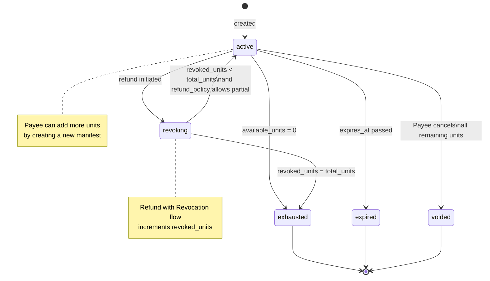
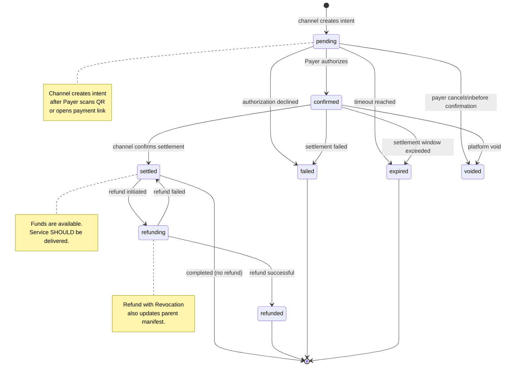
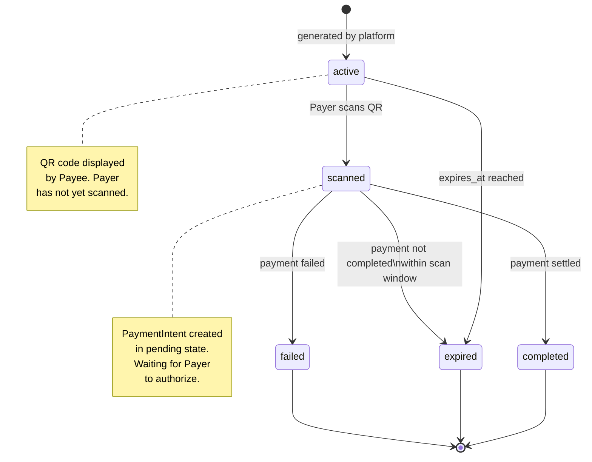
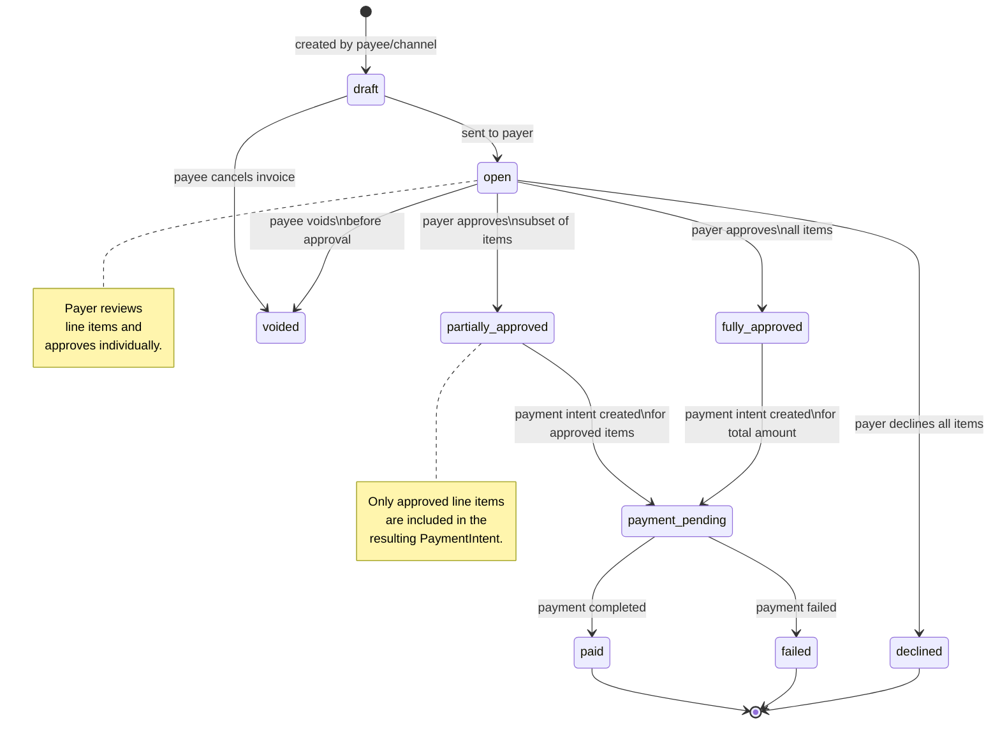
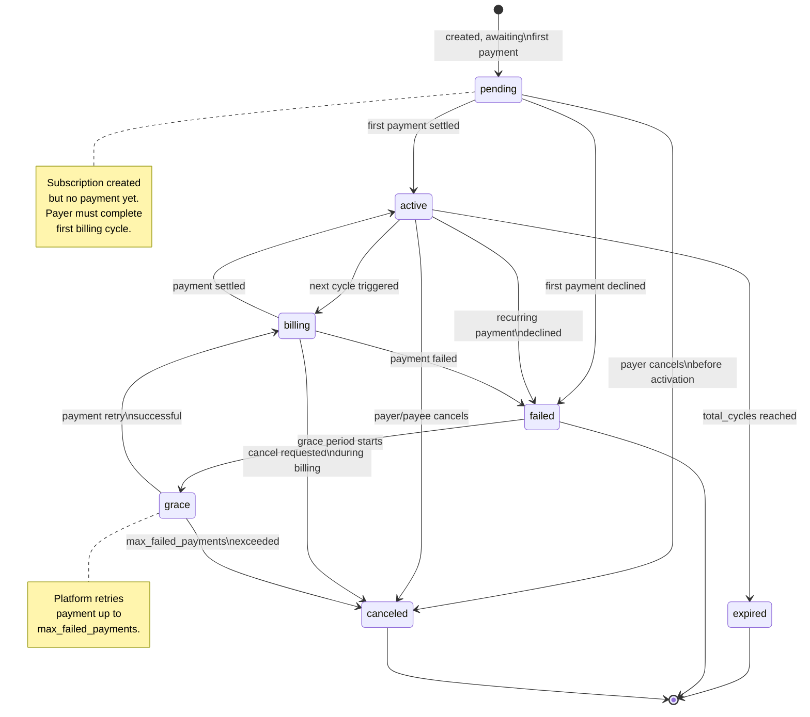
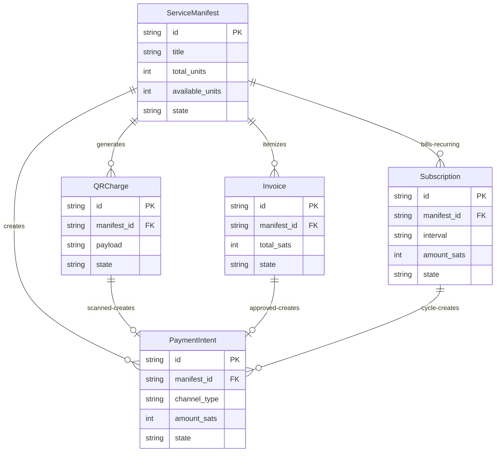

# Core Objects

This section defines the five core objects in the ItPay Protocol: **ServiceManifest**, **PaymentIntent**, **QRCharge**, **Invoice**, and **Subscription**. Each object has a defined schema with typed fields, a formal state machine governing valid state transitions, and a set of webhook events emitted on each transition.

All objects MUST be serialized as JSON. Field names use `snake_case`. Objects include a `metadata` map for extensibility. The Platform MUST preserve all metadata through state transitions.

## ServiceManifest

The **ServiceManifest** is the root object of every payment interaction. It represents a Payee's offer to sell a service. All other protocol objects (PaymentIntent, QRCharge, Invoice, Subscription) derive from a ServiceManifest.

A ServiceManifest is created by the Payee and is immutable after creation — except for the `revoked_units` counter, which MAY be incremented via the Refund with Revocation flow.

### Schema

| Field | Type | Required | Description |
|-------|------|----------|-------------|
| `id` | `string` | REQUIRED | Unique identifier, prefixed `sm_`. Generated by Platform on creation. |
| `version` | `integer` | REQUIRED | Monotonically increasing version number. Starts at 1. |
| `payee_id` | `string` | REQUIRED | Identifier of the Payee who created this manifest. MUST be a valid platform account ID. |
| `title` | `string` | REQUIRED | Human-readable title of the service being offered (max 256 chars). |
| `description` | `string` | OPTIONAL | Detailed description of the service (max 4096 chars). |
| `unit_type` | `string` | REQUIRED | The unit of service (e.g., "hour", "item", "session", "token", "meal"). |
| `total_units` | `integer` | REQUIRED | Total number of units initially available (MUST be ≥ 1). |
| `revoked_units` | `integer` | REQUIRED | Number of units revoked through refunds. Starts at 0. |
| `available_units` | `integer` | REQUIRED | Calculated as `total_units - revoked_units`. Read-only. |
| `currency` | `string` | REQUIRED | ISO 4217 currency code (e.g., "USD", "EUR", "BTC"). |
| `unit_price_sats` | `integer` | REQUIRED | Price per unit in satoshi units (1 sat = 0.00000001 BTC). MUST be ≥ 1. |
| `total_price_sats` | `integer` | REQUIRED | Calculated as `available_units × unit_price_sats`. Read-only. |
| `accepted_channels` | `array` | REQUIRED | Array of channel configurations the Payee accepts. Each entry has `channel_type` (string, REQUIRED), `enabled` (boolean, REQUIRED), and `config` (object, OPTIONAL). |
| `refund_policy` | `object` | OPTIONAL | Refund policy definition. Contains `window_seconds` (integer, how long after settlement refunds are accepted), `prorated` (boolean, whether partial refunds are allowed). |
| `expires_at` | `integer` | OPTIONAL | Unix timestamp after which this manifest is no longer valid for new payment intents. |
| `metadata` | `object` | OPTIONAL | Custom key-value metadata (keys max 64 chars, values max 1024 chars). |
| `created_at` | `integer` | REQUIRED | Unix timestamp when the manifest was created. |
| `updated_at` | `integer` | REQUIRED | Unix timestamp when the manifest was last modified. |

### State Machine



### State Descriptions

| State | Meaning | Legal Transitions |
|-------|---------|-------------------|
| `active` | Manifest is accepting new payment intents. Units are available for purchase. | `exhausted`, `expired`, `revoking`, `voided` |
| `exhausted` | All units have been sold (total_units - revoked_units = 0). No new payments. | — (terminal) |
| `expired` | The `expires_at` timestamp has passed. No new payments. | — (terminal) |
| `revoking` | A refund is in progress. System is adjusting the revoked_units counter. | `active`, `exhausted` |
| `voided` | Payee requested to void all remaining units. No new payments. | — (terminal) |

### Webhook Events

| Event | Trigger |
|-------|---------|
| `manifest.created` | A new manifest has been created and is now active. |
| `manifest.updated` | Manifest metadata (e.g., accepted_channels, metadata) was updated. |
| `manifest.revoked` | Units were revoked via the refund flow. Contains `previous_available_units` and `new_available_units` in the webhook payload. |

### Example

```json
{
  "id": "sm_abc123def456",
  "version": 1,
  "payee_id": "payee_merchant_001",
  "title": "Consulting Hour",
  "description": "One hour of technical consulting via video call",
  "unit_type": "hour",
  "total_units": 10,
  "revoked_units": 0,
  "available_units": 10,
  "currency": "USD",
  "unit_price_sats": 1000000,
  "total_price_sats": 10000000,
  "accepted_channels": [
    { "channel_type": "qr_code", "enabled": true },
    { "channel_type": "payment_link", "enabled": true },
    { "channel_type": "lightning", "enabled": true, "config": { "max_amount": 5000000 } }
  ],
  "refund_policy": { "window_seconds": 86400, "prorated": true },
  "expires_at": 1751328000,
  "metadata": { "merchant_category": "services" },
  "created_at": 1717084800,
  "updated_at": 1717084800
}
```

## PaymentIntent

A **PaymentIntent** represents a single payment attempt against a ServiceManifest. It is created by a Channel adapter when a Payer initiates a payment. The PaymentIntent tracks the full lifecycle of the payment from initiation through settlement (or failure).

### Schema

| Field | Type | Required | Description |
|-------|------|----------|-------------|
| `id` | `string` | REQUIRED | Unique identifier, prefixed `pi_`. Generated by Platform. |
| `manifest_id` | `string` | REQUIRED | The ServiceManifest this payment is for. |
| `channel_type` | `string` | REQUIRED | The channel adapter used (e.g., "qr_code", "lightning"). |
| `channel_reference` | `string` | OPTIONAL | Channel-specific transaction reference (tx hash, auth code). Populated on confirmation. |
| `payer_id` | `string` | OPTIONAL | Channel-issued identifier for the Payer. May be anonymous. |
| `amount_sats` | `integer` | REQUIRED | The amount being paid, in satoshi units. MUST be a positive integer. |
| `units_requested` | `integer` | REQUIRED | Number of service units being purchased. |
| `units_settled` | `integer` | REQUIRED | Number of units that actually settled (may differ from requested in partial settlement). |
| `state` | `string` | REQUIRED | Current state of the payment intent (see state machine). |
| `error_code` | `string` | OPTIONAL | Error code if the payment failed. Populated only in `failed` state. |
| `error_message` | `string` | OPTIONAL | Human-readable error description. |
| `void_reason` | `string` | OPTIONAL | Reason for voiding, if applicable. |
| `idempotency_key` | `string` | OPTIONAL | Idempotency key used for creation (stored for replay detection). |
| `confirmed_at` | `integer` | OPTIONAL | Unix timestamp when the Payer confirmed the payment. |
| `settled_at` | `integer` | OPTIONAL | Unix timestamp when the channel confirmed settlement. |
| `refunded_at` | `integer` | OPTIONAL | Unix timestamp when the refund completed. |
| `voided_at` | `integer` | OPTIONAL | Unix timestamp when the payment was voided. |
| `metadata` | `object` | OPTIONAL | Custom key-value metadata. |
| `created_at` | `integer` | REQUIRED | Unix timestamp when the intent was created. |
| `updated_at` | `integer` | REQUIRED | Unix timestamp of last modification. |

### State Machine



### State Descriptions

| State | Meaning | Legal Transitions |
|-------|---------|-------------------|
| `pending` | Payment intent created, awaiting Payer authorization. | `confirmed`, `failed`, `expired`, `voided` |
| `confirmed` | Payer has authorized the payment. Platform awaits settlement confirmation from channel. | `settled`, `failed`, `expired`, `voided` |
| `settled` | Channel has confirmed settlement. Funds are available. Service SHOULD be delivered. | `refunding`, terminal |
| `failed` | The payment could not be processed. Error details available. | — (terminal) |
| `expired` | The payment intent's timeout was reached without successful settlement. | — (terminal) |
| `refunding` | A refund is in progress. Awaiting channel confirmation. | `refunded`, `settled` (on refund failure) |
| `refunded` | Refund has been completed. Funds returned to Payer. | — (terminal) |
| `voided` | Payment was canceled before or after confirmation but before settlement. | — (terminal) |

### Transition Rules

1. From `pending`, the Platform MUST validate that the manifest has sufficient available units before transitioning to `confirmed`.
2. From `confirmed`, the Platform MUST set `confirmed_at` and start the settlement timer.
3. From `confirmed` to `settled`, the Platform MUST decrement `available_units` on the parent ServiceManifest by `units_settled`.
4. From `settled` to `refunding`, the Platform MUST verify the refund policy allows the refund (time window, amount limits).
5. From `refunding` to `refunded`, the Platform MUST increment `revoked_units` on the parent ServiceManifest by the refunded units.
6. The Platform MUST reject any transition that is not in the legal set with an `invalid_state_transition` error.

### Webhook Events

| Event | Trigger |
|-------|---------|
| `payment_intent.created` | PaymentIntent created in `pending` state. |
| `payment_intent.confirmed` | Payer authorized the payment. |
| `payment_intent.settled` | Settlement confirmed by channel. Contains `funds_available` boolean. |
| `payment_intent.failed` | Payment failed. Contains `error_code` and `error_message`. |
| `payment_intent.refunded` | Refund completed. Contains `refund_amount_sats` and `units_revoked`. |
| `payment_intent.voided` | Payment voided. Contains `void_reason`. |

### Example

```json
{
  "id": "pi_789ghi012jkl",
  "manifest_id": "sm_abc123def456",
  "channel_type": "qr_code",
  "channel_reference": "ch_tx_987654",
  "payer_id": "anon_payer_x3k9m",
  "amount_sats": 1000000,
  "units_requested": 1,
  "units_settled": 1,
  "state": "settled",
  "confirmed_at": 1717084860,
  "settled_at": 1717084920,
  "created_at": 1717084800,
  "updated_at": 1717084920
}
```

## QRCharge

A **QRCharge** is a pre-generated QR code payload linked to a ServiceManifest. It represents a specific scan target that, when scanned by a Payer, creates a PaymentIntent. QRCharges have their own lifecycle independent of the payment they eventually generate.

### Schema

| Field | Type | Required | Description |
|-------|------|----------|-------------|
| `id` | `string` | REQUIRED | Unique identifier, prefixed `qr_`. |
| `manifest_id` | `string` | REQUIRED | The parent ServiceManifest. |
| `nonce` | `string` | REQUIRED | Cryptographic nonce used in the QR payload to prevent replay. |
| `payload` | `string` | REQUIRED | The encoded URL payload. Format: `itpay://pay/{manifest_id}?channel=qr&nonce={nonce}` |
| `image_url` | `string` | OPTIONAL | URL to a rendered QR code PNG image generated by the Platform. |
| `amount_sats` | `integer` | OPTIONAL | Fixed payment amount. If not set, Payer may enter custom amount. |
| `state` | `string` | REQUIRED | Current state. See state machine. |
| `generated_intent_id` | `string` | OPTIONAL | The PaymentIntent created when this QR was scanned, if any. |
| `scanned_at` | `integer` | OPTIONAL | Unix timestamp when the QR was first scanned. |
| `expires_at` | `integer` | REQUIRED | Unix timestamp when this QR charge expires (default: 30 minutes from creation). |
| `metadata` | `object` | OPTIONAL | Custom key-value metadata. |
| `created_at` | `integer` | REQUIRED | Unix timestamp when the QR was generated. |
| `updated_at` | `integer` | REQUIRED | Unix timestamp of last modification. |

### State Machine



### Example

```json
{
  "id": "qr_456mno789pqr",
  "manifest_id": "sm_abc123def456",
  "nonce": "a1b2c3d4e5f6",
  "payload": "itpay://pay/sm_abc123def456?channel=qr&nonce=a1b2c3d4e5f6",
  "image_url": "https://api.itpay.dev/v1/qr/456mno789pqr.png",
  "amount_sats": 1000000,
  "state": "scanned",
  "generated_intent_id": "pi_789ghi012jkl",
  "scanned_at": 1717084830,
  "expires_at": 1717086600,
  "created_at": 1717084800,
  "updated_at": 1717084830
}
```

## Invoice

An **Invoice** is a structured payment request with line items. It is created from a ServiceManifest when the Payee or Channel generates an itemized bill. The Payer MAY approve the invoice in full or approve only a subset of line items.

### Schema

| Field | Type | Required | Description |
|-------|------|----------|-------------|
| `id` | `string` | REQUIRED | Unique identifier, prefixed `inv_`. |
| `manifest_id` | `string` | REQUIRED | The parent ServiceManifest. |
| `payer_id` | `string` | OPTIONAL | Payer identifier if known at invoice creation. |
| `line_items` | `array` | REQUIRED | Array of line item objects. Each item has: `description` (string, REQUIRED), `units` (integer, REQUIRED), `unit_price_sats` (integer, REQUIRED), `total_sats` (integer, computed: `units × unit_price_sats`), `approved` (boolean, defaults to false). |
| `total_sats` | `integer` | REQUIRED | Sum of all line item totals. |
| `approved_sats` | `integer` | REQUIRED | Sum of totals for approved line items. Starts at 0. |
| `state` | `string` | REQUIRED | Current state. See state machine. |
| `generated_intent_id` | `string` | OPTIONAL | PaymentIntent created from this invoice, if any. |
| `due_at` | `integer` | OPTIONAL | Unix timestamp by which payment must be made. |
| `note` | `string` | OPTIONAL | Free-text note from the Payee to the Payer. |
| `metadata` | `object` | OPTIONAL | Custom key-value metadata. |
| `created_at` | `integer` | REQUIRED | Unix timestamp when invoice was created. |
| `updated_at` | `integer` | REQUIRED | Unix timestamp of last modification. |

### State Machine



### Example

```json
{
  "id": "inv_321stu987vwx",
  "manifest_id": "sm_abc123def456",
  "line_items": [
    {
      "description": "Consulting - Hour 1",
      "units": 1,
      "unit_price_sats": 1000000,
      "total_sats": 1000000,
      "approved": true
    },
    {
      "description": "Consulting - Hour 2",
      "units": 1,
      "unit_price_sats": 1000000,
      "total_sats": 1000000,
      "approved": true
    },
    {
      "description": "Report Preparation",
      "units": 1,
      "unit_price_sats": 500000,
      "total_sats": 500000,
      "approved": false
    }
  ],
  "total_sats": 2500000,
  "approved_sats": 2000000,
  "state": "partially_approved",
  "generated_intent_id": null,
  "due_at": 1717171200,
  "note": "Thank you for your business!",
  "created_at": 1717084800,
  "updated_at": 1717084860
}
```

### Partial Approval Rules

1. When the Payer submits approval, the Platform MUST create a `partially_approved` or `fully_approved` state.
2. In the `partially_approved` state, the Platform MUST generate a PaymentIntent for ONLY the approved line items.
3. The generated PaymentIntent's `amount_sats` MUST equal `approved_sats`.
4. The generated PaymentIntent's `units_requested` MUST equal the sum of `units` for approved line items.
5. Line items that were NOT approved remain in the invoice with `approved: false` and MAY be re-approved later (if the Payee's policy allows).

## Subscription

A **Subscription** represents a recurring payment agreement between a Payer and a Payee, linked to a ServiceManifest. It defines a billing schedule, and the Platform automatically creates PaymentIntents at each billing cycle.

### Schema

| Field | Type | Required | Description |
|-------|------|----------|-------------|
| `id` | `string` | REQUIRED | Unique identifier, prefixed `sub_`. |
| `manifest_id` | `string` | REQUIRED | The parent ServiceManifest. Each subscription MUST reference an active manifest. |
| `payer_id` | `string` | REQUIRED | Authenticated identifier of the Payer. Unlike other objects, subscriptions require an identified Payer. |
| `amount_sats` | `integer` | REQUIRED | Amount to charge per billing cycle. |
| `units_per_cycle` | `integer` | REQUIRED | Number of service units delivered per billing cycle. |
| `interval` | `string` | REQUIRED | Billing interval: `daily`, `weekly`, `monthly`, `quarterly`, `yearly`. |
| `interval_count` | `integer` | REQUIRED | Number of intervals between billings (e.g., interval=monthly, interval_count=3 = quarterly). |
| `current_cycle` | `integer` | REQUIRED | The current billing cycle number (starts at 1). |
| `total_cycles` | `integer` | OPTIONAL | Total number of billing cycles. If omitted, subscription continues until canceled. |
| `grace_period_seconds` | `integer` | OPTIONAL | How long after a failed payment the subscription remains active before canceling (default: 86400 — 24 hours). |
| `failed_payments_count` | `integer` | REQUIRED | Consecutive failed payment attempts. Starts at 0. |
| `max_failed_payments` | `integer` | REQUIRED | Maximum consecutive failed payments before automatic cancellation (default: 3). |
| `next_billing_at` | `integer` | OPTIONAL | Unix timestamp of the next scheduled billing. |
| `channel_type` | `string` | REQUIRED | The channel adapter used for recurring payments. MUST support `supportsSubscription: true`. |
| `state` | `string` | REQUIRED | Current state. See state machine. |
| `cancel_reason` | `string` | OPTIONAL | Reason provided for cancellation, if any. |
| `metadata` | `object` | OPTIONAL | Custom key-value metadata. |
| `started_at` | `integer` | OPTIONAL | Unix timestamp when the subscription was activated (first payment settled). |
| `canceled_at` | `integer` | OPTIONAL | Unix timestamp when the subscription was canceled. |
| `created_at` | `integer` | REQUIRED | Unix timestamp when the subscription was created. |
| `updated_at` | `integer` | REQUIRED | Unix timestamp of last modification. |

### State Machine



### State Descriptions

| State | Meaning | Legal Transitions |
|-------|---------|-------------------|
| `pending` | Subscription created, awaiting first payment settlement. | `active`, `failed`, `canceled` |
| `active` | First payment settled. Subscription is in good standing. | `billing`, `canceled`, `failed`, `expired` |
| `billing` | Current billing cycle is in process. PaymentIntent has been created. | `active`, `failed`, `canceled` |
| `failed` | Most recent payment failed. Subscription enters grace period or error state. | `grace`, terminal |
| `grace` | Grace period active. Platform will retry payment. | `billing`, `canceled` |
| `canceled` | Subscription terminated before or during its lifecycle. No further billings. | — (terminal) |
| `expired` | Subscription completed all planned cycles (`total_cycles` reached). | — (terminal) |

### Billing Cycle Rules

1. The Platform MUST create a PaymentIntent for each billing cycle when `next_billing_at` is reached.
2. The PaymentIntent created for a billing cycle MUST reference the parent subscription in its `metadata` (`subscription_id` key).
3. On successful settlement of a billing cycle PaymentIntent, the Platform MUST:
   - Increment `current_cycle` by 1.
   - Update `next_billing_at` to the next scheduled date.
   - Reset `failed_payments_count` to 0.
   - Transition the subscription state back to `active`.
4. On payment failure of a billing cycle PaymentIntent, the Platform MUST:
   - Increment `failed_payments_count` by 1.
   - Enter `grace` state.
   - Schedule a retry with exponential backoff (1 hour, 2 hours, 4 hours, etc., up to `max_failed_payments` attempts).
5. If `failed_payments_count` reaches `max_failed_payments`, the Platform MUST cancel the subscription and transition to `canceled`.

### Example

```json
{
  "id": "sub_987xzy654rts",
  "manifest_id": "sm_abc123def456",
  "payer_id": "auth_payer_john_doe",
  "amount_sats": 10000000,
  "units_per_cycle": 10,
  "interval": "monthly",
  "interval_count": 1,
  "current_cycle": 3,
  "total_cycles": 12,
  "grace_period_seconds": 86400,
  "failed_payments_count": 0,
  "max_failed_payments": 3,
  "next_billing_at": 1719763200,
  "channel_type": "wallet_push",
  "state": "active",
  "started_at": 1717084800,
  "created_at": 1717084800,
  "updated_at": 1719763200
}
```

## Object Relationships

The following diagram shows how the five core objects relate to each other:



## Field Validation Rules

All implementers MUST enforce the following validation rules:

1. **String fields**: MUST NOT exceed their specified maximum length. Empty string `""` is only valid for `description` and `note` — all other string fields MUST contain at least one non-whitespace character.
2. **Integer fields**: MUST be non-negative unless otherwise stated. `total_units`, `unit_price_sats`, `amount_sats`, `units_per_cycle` MUST be ≥ 1.
3. **Currency codes**: MUST be valid ISO 4217 alphabetic codes (3 uppercase characters). The special value `"SAT"` MAY be used for satoshi-only payments.
4. **Timestamps**: MUST be Unix timestamps in seconds (integer). Platforms MUST reject timestamps more than 10 minutes in the future (to prevent clock-sync abuse), except for `expires_at` and `due_at` which MAY be further in the future.
5. **Ids**: All object IDs MUST be prefixed with the appropriate short code (`sm_`, `pi_`, `qr_`, `inv_`, `sub_`) and MUST be globally unique within the Platform.
6. **Metadata**: Keys MUST match `^[a-zA-Z0-9_-]{1,64}$`. Values MUST NOT exceed 1024 characters. Total metadata size MUST NOT exceed 16 KB.
7. **Channel configurations**: The `accepted_channels` array MUST contain at least one entry. Duplicate `channel_type` values are not allowed.
