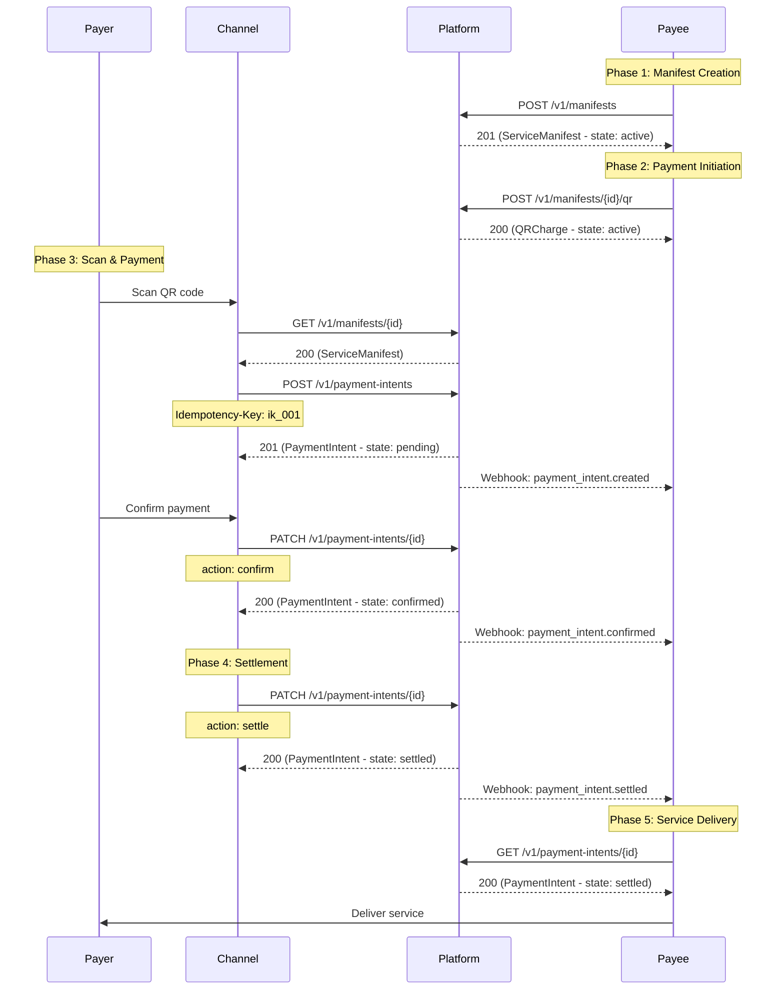
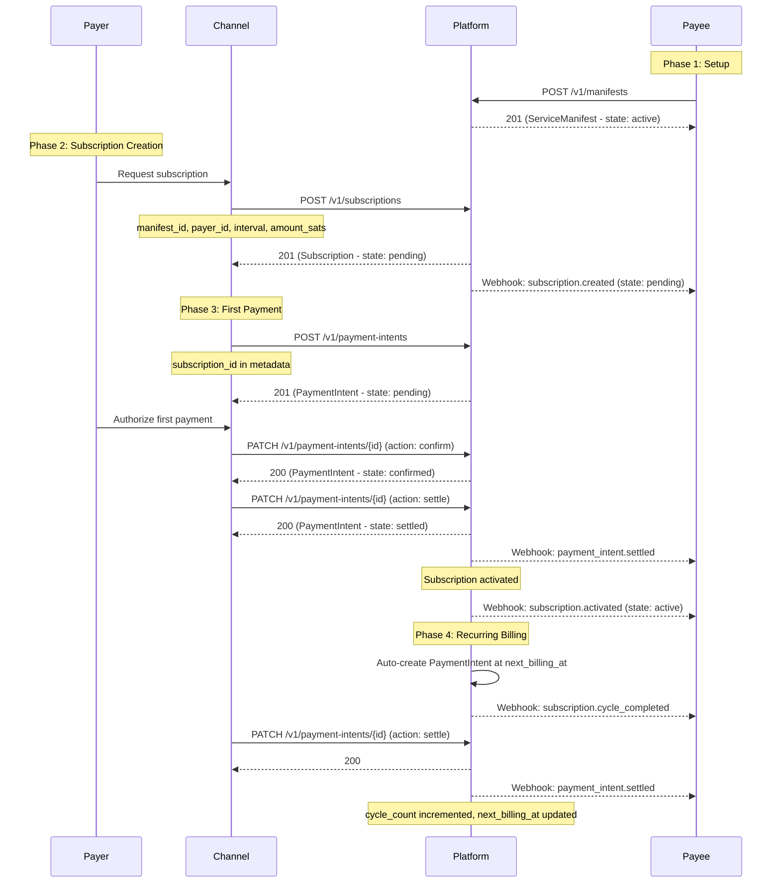
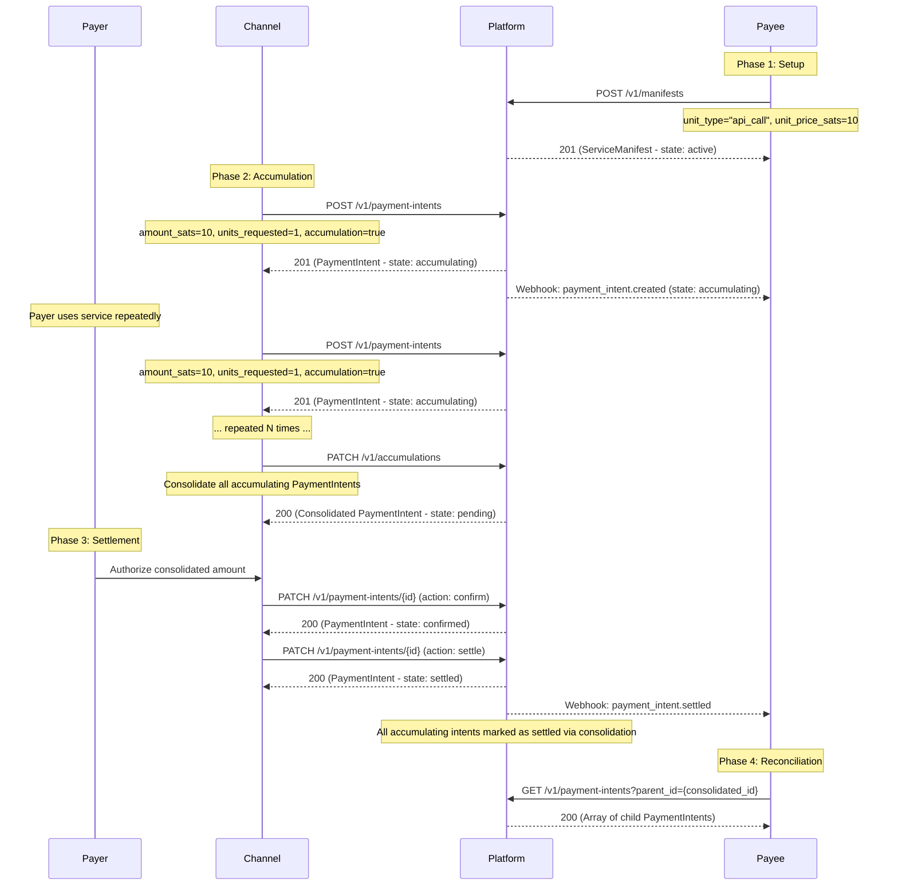
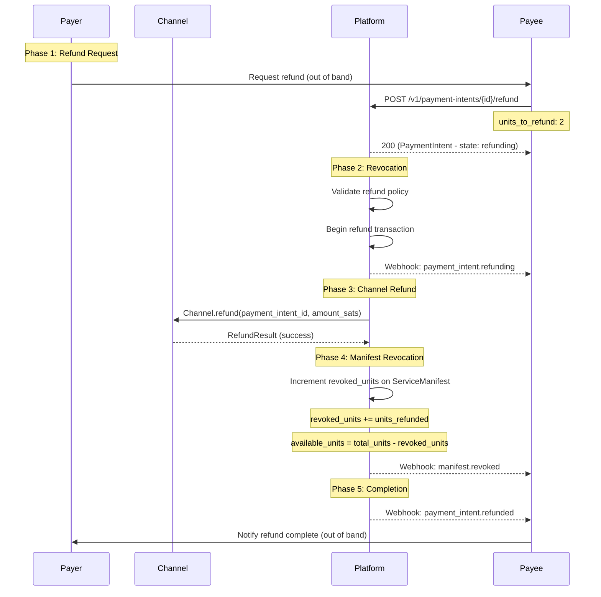
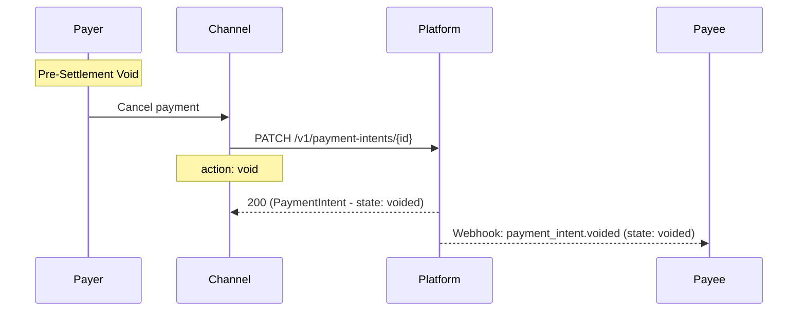
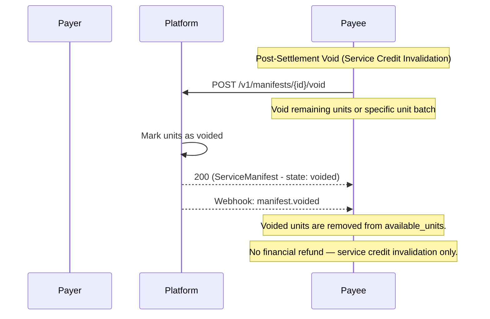

# Payment Lifecycle

This section defines the complete payment lifecycle flows supported by the ItPay Protocol. Each flow describes the sequence of HTTP calls, state transitions on core objects, and webhook events emitted. All flows assume the four-party model (Payer, Payee, Channel, Platform) as defined in the Architecture section.

The following flows are defined:

- **One-Time Pay**: A single, immediate payment for a fixed number of service units.
- **Subscribe Pay**: A recurring payment agreement with automated billing cycles.
- **Cumulative Pay**: Aggregation of multiple small payments into a single settlement event.
- **Refund with Revocation**: Returning funds to the Payer while revoking previously settled service units.
- **Void Service**: Canceling a payment before settlement or invalidating already-settled service credits.

## One-Time Pay

The One-Time Pay flow is the simplest and most common payment interaction. A Payer initiates a single payment for a fixed number of units from a ServiceManifest. The flow proceeds through Payer authorization, channel settlement, and Payee notification.

### HTTP Call Flow



### State Transitions

The following objects undergo state transitions during the One-Time Pay flow:

#### ServiceManifest

```
active (initial)
  │
  │  available_units decremented by units_settled
  │  (only when payment_intent transitions confirmed → settled)
  ▼
active (or exhausted if available_units reaches 0)
```

The ServiceManifest remains in `active` state throughout the flow unless all units are consumed, in which case it transitions to `exhausted`.

#### PaymentIntent

```
[*] ──► pending ──► confirmed ──► settled ──► [*]
```

| Transition | Trigger | Actor | Side Effects |
|------------|---------|-------|-------------|
| `[*] → pending` | Channel calls `POST /v1/payment-intents` | Channel | `payment_intent.created` webhook emitted. Manifest validated for available units. |
| `pending → confirmed` | Channel calls `PATCH` with `action: confirm` | Channel | `confirmed_at` set. `payment_intent.confirmed` webhook emitted. Idempotency key stored. |
| `confirmed → settled` | Channel calls `PATCH` with `action: settle` | Channel | `settled_at` set. Manifest `available_units` decremented. `payment_intent.settled` webhook emitted. |

#### QRCharge

```
active ──► scanned ──► completed
```

### API Endpoints

| Method | Path | Purpose |
|--------|------|---------|
| `POST` | `/v1/manifests` | Create a new ServiceManifest |
| `POST` | `/v1/manifests/{id}/qr` | Generate a QR charge for a manifest |
| `GET` | `/v1/manifests/{id}` | Retrieve a manifest |
| `POST` | `/v1/payment-intents` | Create a new payment intent |
| `PATCH` | `/v1/payment-intents/{id}` | Transition payment intent state |
| `GET` | `/v1/payment-intents/{id}` | Retrieve a payment intent |

### Webhook Events

| Event | Phase | Payload Contains |
|-------|-------|-----------------|
| `payment_intent.created` | After Channel creates intent | Full PaymentIntent object in `pending` state |
| `payment_intent.confirmed` | After Payer authorizes | PaymentIntent in `confirmed` state, includes `confirmed_at` |
| `payment_intent.settled` | After Channel settles | PaymentIntent in `settled` state, includes `settled_at`, `funds_available: true` |

### Error Flows

#### Authorization Declined

If the Payer's authorization is declined by the Channel:

```
pending ──► failed
```

- `payment_intent.failed` webhook emitted with `error_code: "authorization_declined"`.
- The Payee is notified. No units are consumed.
- The Payer MAY retry with a new payment intent.

#### Confirmation Timeout

If the Payer does not authorize within the configured timeout (default: 15 minutes):

```
pending ──► expired
```

- `payment_intent.failed` webhook emitted with `error_code: "timeout"`.
- The QR code or payment link is no longer valid.

#### Settlement Failure

If the Channel reports that settlement failed after confirmation:

```
confirmed ──► failed
```

- `payment_intent.failed` webhook emitted with `error_code: "settlement_failed"`.
- No units are consumed from the manifest.
- The Platform SHOULD attempt to un-reserve any held units from the manifest (or the manifest design should prevent reservation before settlement).

### Idempotency

The `POST /v1/payment-intents` endpoint MUST support idempotency. If the same `Idempotency-Key` is received within 24 hours, the Platform MUST return the previously created PaymentIntent rather than creating a duplicate.

## Subscribe Pay

The Subscribe Pay flow handles recurring billing. A Payer enters into a subscription agreement, and the Platform automatically creates PaymentIntents at each billing cycle.

### HTTP Call Flow



### State Transitions

#### Subscription

```
[*] ──► pending ──► active ──► billing ──► active ──► billing ──► ...
```

| Transition | Trigger | Actor | Side Effects |
|------------|---------|-------|-------------|
| `[*] → pending` | Payee/Channel calls `POST /v1/subscriptions` | Channel | `subscription.created` webhook. Gateway validates channel supports subscriptions. |
| `pending → active` | First billing cycle PaymentIntent settles | Platform | `subscription.activated` webhook. `started_at` set. First cycle begins. |
| `active → billing` | `next_billing_at` reached (scheduled job) | Platform | New PaymentIntent auto-created. `subscription.billing_started` webhook (OPTIONAL). |
| `billing → active` | Billing cycle PaymentIntent settles | Platform | `current_cycle` incremented. `next_billing_at` updated. `subscription.cycle_completed` webhook. |
| `active → failed` | Billing payment fails | Platform | `failed_payments_count` incremented. Enters retry logic. |
| `failed → grace` | Auto-transitioned on payment failure | Platform | Grace period timer starts. Payment retry scheduled. |
| `grace → billing` | Retry payment succeeds | Platform | `failed_payments_count` reset to 0. Cycle proceeds. |
| `any → canceled` | Payer/Payee requests cancellation | Payer or Payee | `subscription.canceled` webhook. All pending PaymentIntents voided. |
| `active → expired` | `current_cycle >= total_cycles` | Platform | `subscription.expired` webhook. No further action. |

### API Endpoints

| Method | Path | Purpose |
|--------|------|---------|
| `POST` | `/v1/subscriptions` | Create a new subscription |
| `GET` | `/v1/subscriptions/{id}` | Retrieve subscription details |
| `PATCH` | `/v1/subscriptions/{id}` | Update subscription (pause, resume, cancel) |
| `POST` | `/v1/subscriptions/{id}/cancel` | Cancel a subscription |

### Webhook Events

| Event | Description |
|-------|-------------|
| `subscription.created` | Subscription created, awaiting first payment. |
| `subscription.activated` | First payment settled, subscription is now active. |
| `subscription.cycle_completed` | A billing cycle completed successfully. Contains `cycle_number`, `amount_sats`, `next_billing_at`. |
| `subscription.payment_failed` | A recurring payment failed. Contains `failed_payments_count`, `next_retry_at`. |
| `subscription.canceled` | Subscription terminated. Contains `cancel_reason` if provided. |
| `subscription.expired` | All planned cycles completed. |

### Idempotency for Subscriptions

The `POST /v1/subscriptions` endpoint MUST support idempotency to prevent duplicate subscription creation during network retries. If the same `Idempotency-Key` is received, the Platform MUST return the previously created subscription.

### Grace Period Retry Logic

The Platform MUST implement the following retry schedule during the grace period:

1. **Retry 1**: Attempt immediately upon entering grace state.
2. **Retry 2**: 1 hour after the first failure.
3. **Retry 3**: 4 hours after the second failure.
4. **Retry 4**: 12 hours after the third failure.
5. **Retry 5**: 24 hours after the fourth failure (last attempt if `max_failed_payments` = 5).

If `failed_payments_count >= max_failed_payments` after any retry, the subscription transitions to `canceled`.

## Cumulative Pay

The Cumulative Pay flow aggregates multiple small payments (microtransactions) into a single settlement event. This is designed for use cases like metered billing, per-use pricing, or streaming payments where individual transactions are small but total value accumulates over time.

### HTTP Call Flow



### State Transitions

#### PaymentIntent (Accumulating Mode)

```
[*] ──► accumulating ──► consolidated ──► pending ──► confirmed ──► settled ──► [*]
```

| Transition | Trigger | Actor | Side Effects |
|------------|---------|-------|-------------|
| `[*] → accumulating` | Channel creates intent with `accumulation: true` | Channel | Micro-transaction recorded. Added to accumulator pool. |
| `accumulating → consolidated` | Channel calls consolidation endpoint | Channel | All accumulating intents grouped under a parent consolidated PaymentIntent. |
| `consolidated → pending` | Consolidation confirmed by Platform | Platform | Consolidated PaymentIntent created with sum of all micro-intents. |
| `pending → confirmed` | Payer authorizes total | Channel | Standard confirmation flow. |
| `confirmed → settled` | Channel settles | Channel | All child intents marked settled. Total units consumed from manifest. |

### Consolidation Rules

1. The Channel MAY accumulate micro-transactions over any period (configurable per manifest, default: 1 hour).
2. The Channel MUST call the consolidation endpoint to trigger batch settlement.
3. The consolidation endpoint creates a parent PaymentIntent with `amount_sats` equal to the sum of all child intents and `type: consolidated`.
4. Each child PaymentIntent has `parent_intent_id` set to the consolidated intent's ID.
5. When the consolidated intent settles, ALL child intents transition to `settled` atomically.
6. The ServiceManifest's `available_units` is decremented by the consolidated total, not per micro-transaction.

### API Endpoints

| Method | Path | Purpose |
|--------|------|---------|
| `POST` | `/v1/payment-intents` (with `accumulation: true`) | Create accumulating micro-intent |
| `POST` | `/v1/accumulations/consolidate` | Consolidate all pending micro-intents for a manifest+payer pair |
| `GET` | `/v1/payment-intents?parent_id={id}` | List child intents of a consolidated payment |

### Use Cases

- **API metering**: Pay per API call, settled hourly or daily.
- **Bandwidth billing**: Accumulate bandwidth usage, settle at threshold or timer.
- **Streaming payments**: Continuous micropayments that settle after a time bucket.
- **Metered subscriptions**: Base subscription + usage overage accumulated and settled.

## Refund with Revocation

The Refund with Revocation flow returns funds to the Payer while simultaneously revoking the corresponding service units on the ServiceManifest. This prevents double-redemption — once units are refunded, they are permanently revoked and cannot be spent or re-sold.

### HTTP Call Flow



### State Transitions

#### PaymentIntent

```
settled ──► refunding ──► refunded
```

| Transition | Trigger | Actor | Side Effects |
|------------|---------|-------|-------------|
| `settled → refunding` | Payee calls refund endpoint | Payee | `refunding` state set. Refund policy validated. `payment_intent.refunding` webhook. |
| `refunding → refunded` | Channel reports refund success | Platform | `refunded_at` set. Manifest `revoked_units` incremented. `payment_intent.refunded` webhook emitted. |

#### ServiceManifest

```
active ──► revoking ──► active (or exhausted if all units revoked)
```

| Transition | Trigger | Actor | Side Effects |
|------------|---------|-------|-------------|
| `active → revoking` | Refund initiated | Platform | `manifest.revoking` webhook (OPTIONAL). |
| `revoking → active` | Refund successful, units still remain | Platform | `revoked_units` incremented. `available_units` recalculated. `manifest.revoked` webhook. |
| `revoking → exhausted` | Refund successful, `revoked_units == total_units` | Platform | Manifest fully consumed by refunds. `manifest.revoked` webhook with `manifest_exhausted: true`. |

### API Endpoints

| Method | Path | Purpose |
|--------|------|---------|
| `POST` | `/v1/payment-intents/{id}/refund` | Initiate a refund for a settled payment |
| `GET` | `/v1/payment-intents/{id}/refund-status` | Check refund processing status |
| `GET` | `/v1/manifests/{id}/revocations` | Get revocation history for a manifest |

### Webhook Events

| Event | Description |
|-------|-------------|
| `payment_intent.refunding` | Refund processing started. Contains `refund_amount_sats`, `units_to_refund`, `policy_check_passed`. |
| `payment_intent.refunded` | Refund completed. Contains `refunded_at`, `refund_amount_sats`, `units_revoked`, `channel_refund_reference`. |
| `manifest.revoked` | Manifest units revoked. Contains `previous_available_units`, `new_available_units`, `units_revoked_this_event`. |

### Refund Policy

The `refund_policy` field on the ServiceManifest governs refunds:

| Policy Field | Type | Default | Description |
|-------------|------|---------|-------------|
| `window_seconds` | integer | 0 (no refunds) | Time window after settlement during which refunds are accepted. `0` means refunds disabled. |
| `prorated` | boolean | false | If true, partial refunds are allowed (fewer units than originally purchased). |
| `max_refund_percent` | integer | 100 | Maximum percentage of the original payment that can be refunded. |

**Rules:**
1. If `window_seconds` is 0, the Platform MUST reject all refund requests with error `refund_policy_violation`.
2. If `prorated` is false, the full PaymentIntent amount MUST be refunded (`units_to_refund` MUST equal the original `units_settled`).
3. If `prorated` is true, the Payee specifies `units_to_refund`. The refund amount is calculated as `(units_to_refund / units_settled) × amount_sats`.
4. The Platform MUST validate that the current timestamp minus `settled_at` is within `window_seconds`. If exceeded, the refund MUST be rejected.
5. Revoked units are permanently removed from `available_units`. They cannot be un-revoked.

### Refund Failure Handling

If the Channel's `refund()` call fails (e.g., insufficient liquidity, channel does not support refunds):

```
refunding ──► settled
```

- `payment_intent.refund_failed` webhook emitted with `error_code` and `error_message`.
- The PaymentIntent returns to `settled` state.
- The ServiceManifest is NOT modified (no units revoked).
- The Payee MAY retry the refund later or attempt a different refund method.

## Void Service

The Void Service flow cancels a payment that has not yet settled or invalidates service credits that were previously settled. Unlike Refund with Revocation, a Void does not return funds — it cancels the pending transaction or voids the service entitlement without a financial reversal.

### HTTP Call Flow (Pre-Settlement Void)



### HTTP Call Flow (Post-Settlement Void — Credit Invalidation)



### State Transitions

#### Pre-Settlement Void

```
pending ──► voided
confirmed ──► voided
```

| Transition | Trigger | Actor | Side Effects |
|------------|---------|-------|-------------|
| `pending → voided` | Payer or Channel requests void | Payer/Channel | `void_reason` set. `voided_at` set. `payment_intent.voided` webhook. Manifest NOT modified (units were never consumed). |
| `confirmed → voided` | Platform or Channel voids after confirmation | Platform/Channel | Same as above. Platform MUST also release any reserved units on the parent manifest (if reservation was used). |

#### Post-Settlement Void (Service Manifest Level)

```
active ──► voided
```

| Transition | Trigger | Actor | Side Effects |
|------------|---------|-------|-------------|
| `active → voided` | Payee calls manifest void endpoint | Payee | All remaining `available_units` marked voided. `manifest.voided` webhook emitted. No new payment intents accepted. Existing pending intents rejected. |

### API Endpoints

| Method | Path | Purpose |
|--------|------|---------|
| `PATCH` | `/v1/payment-intents/{id}` (with `action: void`) | Void a pending or confirmed payment intent |
| `POST` | `/v1/manifests/{id}/void` | Void an entire service manifest (all remaining units) |
| `GET` | `/v1/manifests/{id}/voids` | Get void history for a manifest |

### Webhook Events

| Event | Description |
|-------|-------------|
| `payment_intent.voided` | PaymentIntent voided. Contains `void_reason`, `voided_at`. |
| `manifest.voided` | ServiceManifest voided. Contains `voided_units`, `remaining_units` (always 0 after void). |

### Void vs Refund Comparison

| Aspect | Void (Pre-Settlement) | Refund with Revocation | Void (Post-Settlement) |
|--------|----------------------|----------------------|----------------------|
| **When** | Before settlement | After settlement | After settlement |
| **Funds returned** | No (funds never moved) | Yes | No |
| **Units revoked** | No (units never consumed) | Yes | Yes |
| **Actor** | Payer, Channel, or Platform | Payee only | Payee only |
| **Use case** | Cancel mistaken payment, timeout | Customer satisfaction, dispute resolution | Service policy violation, abuse mitigation |

## Flow Selection Guide

The Payee SHOULD select the appropriate payment flow based on the following criteria:

| Use Case | Recommended Flow | Rationale |
|----------|-----------------|-----------|
| Buy a single item/service | **One-Time Pay** | Simplest flow. Single payment, immediate settlement. |
| Recurring billing (monthly SaaS) | **Subscribe Pay** | Automated billing cycles, built-in retry logic, grace period handling. |
| Per-use billing (API calls) | **Cumulative Pay** | Accumulate micro-transactions, settle as a batch. Reduces transaction fees and UX friction. |
| Customer requested refund | **Refund with Revocation** | Returns funds and revokes units. Audit trail prevents double-spend. |
| Cancel pending purchase | **Void Service** (pre-settlement) | Clean cancellation without financial or unit impact. |
| Invalidate fraudulently obtained credits | **Void Service** (post-settlement) | Remove service entitlement without financial reversal (for non-refundable policy violations). |

## Webhook Delivery Guarantees

All payment lifecycle flows share the following webhook delivery guarantees:

1. **At-least-once delivery**: Webhooks MAY be delivered more than once. Payees MUST deduplicate by event `id`.
2. **Ordering**: Webhooks for the same object type are delivered in state transition order. However, a Payee MUST NOT rely on in-order delivery across different object types.
3. **Retry schedule**: 5 retries at delays [10s, 30s, 2m, 10m, 30m]. After the final retry, the event is marked as `failed_delivery` and the Payee MAY poll the API for the current state.
4. **Timeout**: The Platform awaits an HTTP 200 response within 5 seconds. Any other response (including timeout) is treated as a failure and triggers a retry.
5. **Signature**: Every webhook request includes an `X-Signature` header: `HMAC-SHA256(raw_body, shared_secret)`. Payees MUST verify this signature before processing the event.

## Error Code Reference

The following error codes MAY be returned during payment lifecycle operations:

| Code | HTTP Status | Description |
|------|-------------|-------------|
| `invalid_state_transition` | 422 | The requested transition is not legal from the current state. |
| `manifest_not_found` | 404 | The referenced ServiceManifest does not exist. |
| `manifest_exhausted` | 409 | The manifest has no available units remaining. |
| `manifest_expired` | 410 | The manifest's `expires_at` has passed. |
| `insufficient_units` | 409 | The manifest does not have enough units for the requested amount. |
| `refund_policy_violation` | 422 | The refund request violates the manifest's refund policy. |
| `refund_window_expired` | 422 | The refund window has closed. |
| `channel_not_supported` | 400 | The requested channel is not in the manifest's `accepted_channels`. |
| `channel_not_available` | 503 | The requested channel adapter is currently unavailable. |
| `duplicate_idempotency_key` | 409 | The idempotency key was already used for a different request. |
| `payer_not_found` | 404 | The referenced Payer identity is unknown. |
| `subscription_not_active` | 422 | The subscription must be in `active` state for this operation. |
| `subscription_already_canceled` | 409 | The subscription has already been canceled. |
| `consolidation_empty` | 422 | There are no accumulating intents to consolidate. |
| `unauthorized` | 401 | Authentication credentials are missing or invalid. |
| `forbidden` | 403 | The authenticated actor does not have permission for this operation. |
| `rate_limited` | 429 | Too many requests. Retry after the `Retry-After` header duration. |
